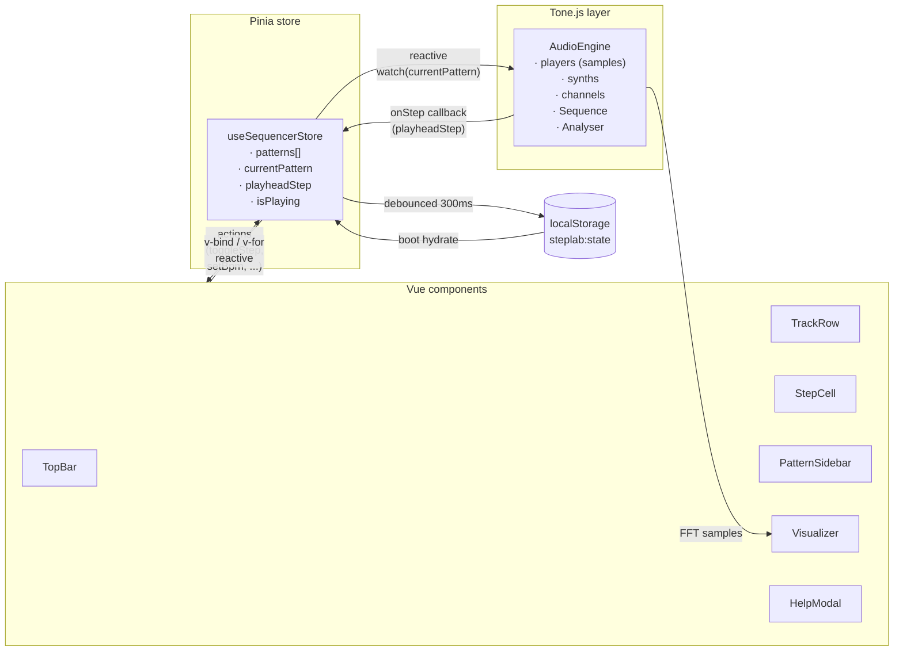
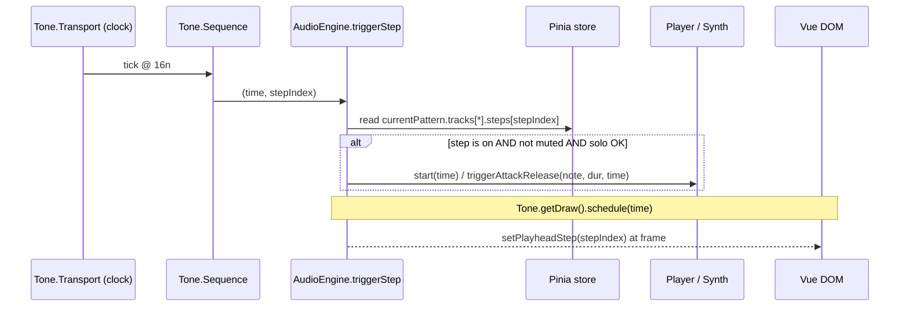
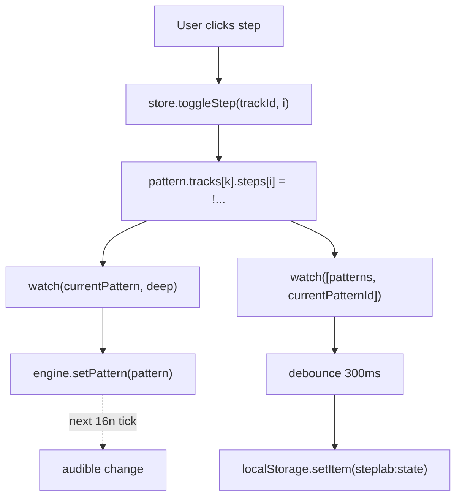
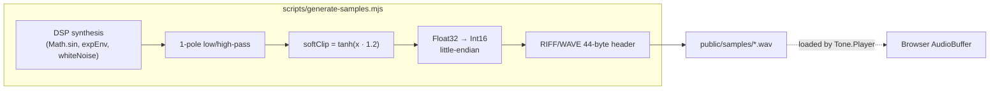

# StepLab

> A browser-native 16-step sequencer. **Vue 3 · TypeScript · Tone.js · Tailwind.**
> Click squares, hear beats. No backend, no accounts, no MIDI files — just the Web Audio API and a Pinia store.


---

## TL;DR

| | |
|---|---|
| **What** | A browser drum machine + synth in the spirit of TR-808 / MPC / Ableton |
| **Who for** | Anyone who wants to throw down a beat in 5 seconds without installing a DAW |
| **How** | 8 tracks × 16 steps, looping, with per-track controls and a reactive visualizer |
| **Where** | 100% client-side — `localStorage` is the database |
| **Code size** | ~1.5k LOC, 361 KB JS bundle (104 KB gzipped) |

---

## Highlight reel

- **Single-loop sequencer** — 16 steps, 8 tracks, tight Tone.js scheduling
- **5 sample-based drums + 3 synths** (`MonoSynth`, `Synth`, `PolySynth(AMSynth)`)
- **Per-track controls** — mute, solo, volume (-40..0 dB), pitch (-12..+12 st)
- **Swing** (0–50%) and **BPM** (60–200) — applied without rebuilding the sequence
- **Save / load patterns** — debounced `localStorage` persistence, versioned schema
- **Canvas visualizer** — 64-band FFT spectrum, track-color gradients, playhead pulse
- **Keyboard-first** — Space, 1–8, Shift+1–8, Ctrl+S, Ctrl+N, C, ?
- **Responsive** — desktop primary, drawer on `<1024px`, scrollable grid on `<380px`
- **Zero runtime network** — fonts via `@fontsource`, samples in `/public`
- **Dark theme by design** — bespoke palette, subtle SVG noise grain, focus rings

---

## Architecture at a glance



**The contract:** the Pinia store is the source of truth. The audio engine is a stateful side-effect that *reads* the store on every step callback and *reports* the playhead position back. Components never talk to Tone.js directly.

---

## The audio scheduling story

Tone.js drives the clock; we just hand it a 16-element array and a callback.

```ts
// engine.ts (simplified)
this.sequence = new Tone.Sequence<number>(
  (time, stepIndex) => {
    this.triggerStep(stepIndex, time)              // audio events
    Tone.getDraw().schedule(                       // visual events
      () => onStep(stepIndex),                     //   sample-accurate
      time,
    )
  },
  [0, 1, 2, ..., 15],
  '16n',                                           // 16th-note grid
)
```



**Why this matters:**
- The sequence is built **once**. BPM/swing/step changes never rebuild it.
- Audio is scheduled with **lookahead time**, not `setTimeout` — no jitter from the JS event loop.
- `Tone.getDraw().schedule` aligns the visual playhead with the audio so the UI feels glued to the sound.

---

## State ↔ audio bridge

The cleanest pattern I found for "Pinia drives Tone.js" without coupling components to audio:

```ts
// useAudio.ts (simplified)
watch(
  () => store.currentPattern,
  (pattern) => {
    if (engine.isReady()) engine.setPattern(pattern)   // pushes diff to engine
  },
  { deep: true },
)
```

`engine.setPattern()` reapplies BPM, swing, per-track volume, pitch, mute & solo derived from the new pattern. Inside the step callback, the engine reads `patternRef` (a stored reference, not a snapshot) so toggles take effect on the **next** step — never mid-step.



---

## Sample generation — pure DSP, no third parties

Drum samples are **generated from scratch** at install time, so there's no licensing question and no binary blob in the repo's history that you didn't write yourself.

```bash
npm run gen-samples
```

`scripts/generate-samples.mjs` is a single Node script with **zero dependencies**: it synthesizes each drum, then writes 16-bit PCM mono WAVs (44.1 kHz) by hand — a 44-byte RIFF/WAVE header followed by `Int16` samples.

| Drum | Recipe |
|---|---|
| **Kick** | Sine sweep 110 → 45 Hz over ~30 ms, fast amplitude decay, plus a noise click |
| **Snare** | 180 Hz + 330 Hz tones (decaying) summed with white noise; high-pass @ 600 Hz |
| **Hi-Hat (closed)** | White noise burst, very fast decay, high-pass @ 7 kHz |
| **Open Hat** | White noise, longer decay, high-pass @ 6 kHz |
| **Clap** | Three 12 ms noise bursts + a longer tail; band-pass 1.2–5 kHz |
| **Tom** | Sine sweep 160 → 90 Hz |
| **Perc** | Inharmonic partial stack (320 / 540 / 870 / 1320 / 1830 Hz) |



> Pitch shifting is implemented as `playbackRate = 2^(semitones/12)` — the classic drum-machine "tape-speed" sound. Tempo and pitch are intentionally coupled.

---

## State model

```ts
interface Pattern {
  id: string                 // nanoid
  name: string
  bpm: number                // 60..200
  swing: number              // 0..0.5
  tracks: TrackState[]       // length 8
  createdAt: number
  updatedAt: number
}

interface TrackState {
  id: TrackId                // 'kick' | 'snare' | ... | 'pad'
  steps: boolean[]           // length 16
  volume: number             // dB
  pitch: number              // semitones
  muted: boolean
  solo: boolean
}

interface PersistedState {
  version: 1                 // forward-migration hook
  currentPatternId: string | null
  patterns: Pattern[]
}
```

A versioned envelope means future schema changes can migrate cleanly instead of corrupting saved patterns on first load.

---

## Tech stack

| Layer | Choice | Why |
|---|---|---|
| Framework | **Vue 3** `<script setup>` + TS strict | Templates beat JSX for static-shape UI; reactivity is fine-grained |
| Build | **Vite 6** | Instant HMR, tiny config, `vue-tsc` for typechecking |
| State | **Pinia** | Composition-API store, no actions/mutations split |
| Audio | **Tone.js 15** | `Transport`, `Sequence`, `Player`, `MonoSynth`, `PolySynth(AMSynth)`, `Channel`, `Analyser` |
| Styling | **Tailwind 3** | Dark-only palette, no UI lib |
| Icons | **lucide-vue-next** | Tree-shakeable, sharp |
| Fonts | **`@fontsource/inter` + `space-grotesk`** | Self-hosted; zero runtime network |
| Persistence | **`localStorage`** | Single source for the demo; debounced 300 ms |
| Visualizer | **Canvas 2D API** | Direct, fast enough for 64 bars at 60 fps |

---

## Project layout

```
src/
├── App.vue                          ← composition root
├── main.ts
├── style.css                        ← Tailwind + CSS vars + grain texture
├── types.ts                         ← TrackId, Pattern, PersistedState
├── audio/
│   ├── engine.ts                    ← AudioEngine (Tone.js wrapper)
│   ├── tracks.ts                    ← TRACK_DEFINITIONS, hello-world beat
│   └── useAudio.ts                  ← Pinia ↔ engine bridge
├── stores/
│   └── sequencer.ts                 ← useSequencerStore
├── composables/
│   ├── useKeyboardShortcuts.ts
│   └── usePersistence.ts            ← load/save + debounce
├── components/
│   ├── TopBar.vue                   ← logo, BPM, swing, play/stop, save, help
│   ├── TrackRow.vue                 ← controls + 16 step cells
│   ├── StepCell.vue                 ← single step button
│   ├── TrackControls.vue            ← mute, solo, volume, pitch
│   ├── PatternSidebar.vue           ← patterns list, rename/dup/delete
│   ├── Visualizer.vue               ← canvas spectrum
│   └── HelpModal.vue
└── utils/id.ts                      ← nanoid wrapper

scripts/
└── generate-samples.mjs             ← DSP → WAV writer

public/samples/                      ← generated WAVs (kick, snare, ...)
```

---

## Track palette

| # | Track | Voice | Color |
|---|---|---|---|
| 1 | Kick | Sample | `#ff5b3a` accent orange |
| 2 | Snare | Sample | `#ffb73a` amber |
| 3 | Hi-Hat | Sample | `#ffe83a` yellow |
| 4 | Open Hat | Sample | `#a3ff3a` lime |
| 5 | Clap | Sample | `#3affc8` cyan |
| 6 | Bass | `Tone.MonoSynth` square @ C2 | `#3a8aff` blue |
| 7 | Lead | `Tone.Synth` triangle @ C4 | `#b13aff` purple |
| 8 | Pad | `Tone.PolySynth(AMSynth)` C-E-G | `#ff3a9b` pink |

The palette also drives the visualizer: 64 spectrum bars are colored by mapping bin index to track index, so the visual *belongs* to the kit.

---

## Keyboard shortcuts

| Key | Action |
|---|---|
| `Space` | Play / Stop |
| `1` – `8` | Toggle **mute** on track 1–8 |
| `Shift` + `1` – `8` | Toggle **solo** on track 1–8 |
| `C` | Clear current pattern |
| `Ctrl/⌘` + `S` | Save (rename) pattern |
| `Ctrl/⌘` + `N` | New pattern |
| `?` | Help modal |

Shortcuts are suppressed while typing in `INPUT` / `TEXTAREA` / `contentEditable`.

---

## Run it yourself

```bash
npm install
npm run gen-samples       # synthesize drum WAVs into public/samples/
npm run dev               # http://localhost:5173

npm run build             # vue-tsc + vite build → dist/
npm run preview           # serve dist/
npm run typecheck         # vue-tsc --noEmit
```

> **Audio caveat:** browsers won't start the `AudioContext` without a user gesture. The first click on **Play** lazily calls `Tone.start()` — that's by design.

---

## Out of scope (on purpose)

No MIDI, no WAV export, no sample upload, no multi-bar song mode, no effects chain, no pattern URLs, no themes, no undo/redo, no cloud sync, no accounts. The product brief was *one polished loop, well done* — discipline beats feature creep.

---

## License

MIT. Drum samples are synthesized from scratch — no third-party attribution required.
